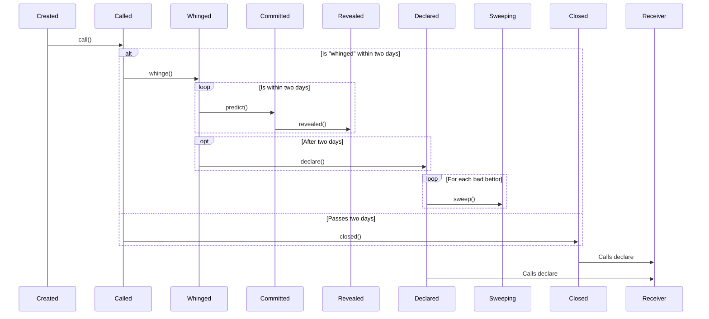

# ARB Infra Markets

ARB Infra Markets is a simple permissionless commit/reveal natural language oracle,
powered by USDC and Staked ARB, built with Arbitrum Stylus. It is primarily used by
[9lives](https://9lives.so), deployed on [Superposition](https://superposition.so) and
Arbitrum One.

