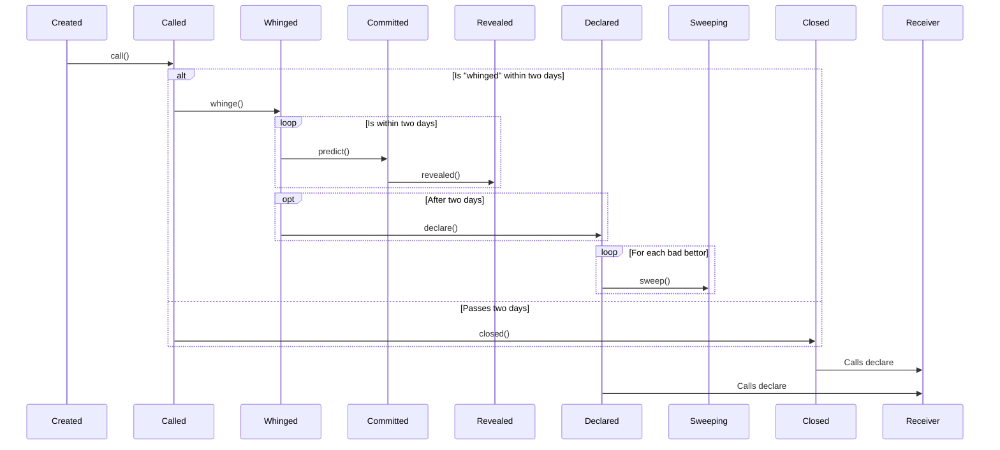

# ARB Infra Markets

ARB Infra Markets is a simple permissionless natural language powered by USDC and Staked
ARB.

```mermaid
sequenceDiagram
    Created ->> Called: call()
    alt Is "whinged" within two days
        Called ->> Whinged: whinge()
        loop Is within two days
            Whinged ->> Committed: predict()
            Committed ->> Revealed: revealed()
        end
        opt After two days
            Whinged ->> Declared: declare()
        end
        loop For each bad bettor
            Declared ->> Sweeping: sweep()
        end
    else Passes two days
        Called ->> Closed: closed()
    end
    Closed ->> Receiver: Calls declare
    Declared ->> Receiver: Calls declare
```
