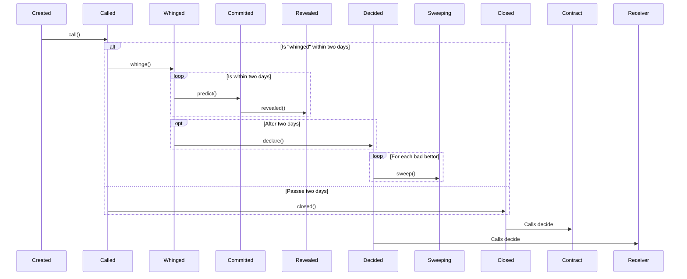

# ARB Infra Markets

ARB Infra Markets are a simple permissionless commit/reveal natural language oracle,
powered by USDC and Staked ARB, built with Arbitrum Stylus. It is primarily used by
[9lives](https://9lives.so), deployed on [Superposition](https://superposition.so) and
Arbitrum One.

[Source code](https://github.com/fluidity-money/9lives.so/blob/main/src/contract_infra_market.rs)



## Terminology

| Identifier |                           Description                             |
|------------|-------------------------------------------------------------------|
| `outcome`  | Votable statement that users can make about a campaign.           |
| Campaign   | A market needing voting to determine an oracle outcome.           |
| Commitment | The providing of a hash of the form `committer . outcome . seed`. |

## Creating a campaign (creating a oracle)

Creating a campaign is calling `register(address tradingAddr, address incentiveSender,
bytes32 desc, uint64 launchTs, uint64 deadlineTs)`. In doing so, you must provide a
creation incentive amount of $3 USDC + (the amount of outcomes * $1 fUSDC).

`tradingAddr` is a contract that implements `IDecidable`:

```solidity
interface IDecidable {
    /**
     * @notice Decide an outcome. Only callable by the oracle!
     * @param outcome to set as the winner.
     */
    function decide(bytes8 outcome) external;
}
```

This is the contract that receives the outcome of the betting.

With `outcome` being the "outcome" that should be determined to be the winner. This could
be `bytes8(0)` to indicate an indeterminate state that needs a rerun, a random identifier
indicating "yes" (ie, `0x199c5aae6c811d3a`), and another random identifier to be "no"
(`0xe527943782f1208d`).

Outcome identifiers can be feasibly created at random, you might create one yourself this
way:

	bytes8(keccak256(abi.encodePacked("Yes", block.timestamp)))


So as a simple story:

1. Erik wishes to create a market to determine if Trump won the 2024 election. In this
example, does so by creating a pari-mutuel betting contract where funds are locked until
conclusion, and distribution is done using weighting:

```solidity
// SPDX-License-Identifier: MIT
pragma solidity ^0.8.6;

interface IERC20 {
    function transferFrom(address, address, uint256) external;
    function approve(address, uint256) external;
    function transfer(address, uint256) external;
}

interface IDecidable {
    /**
     * @notice Decide an outcome. Only callable by the oracle!
     * @param outcome to set as the winner.
     */
    function decide(bytes8 outcome) external;
}

interface IInfraMarket {
    function register(
        address tradingAddr,
        address incentiveSender,
        bytes32 desc,
        uint64 launchTs,
        uint64 deadlineTs
    ) external returns (uint256);
}

contract PariMutuelMarket is IDecidable {
    bool internal created;

    IERC20 immutable ASSET_PREDICTING;
    IERC20 immutable ASSET_FUSDC;

    IInfraMarket immutable INFRA_MARKET;

    mapping(address => uint256) public predictionsTrumpLost;
    mapping(address => uint256) public predictionsTrumpWon;

    uint256 public allocatedTrumpLost;
    uint256 public allocatedTrumpWon;

    bytes8 public outcomeTrumpLost;
    bytes8 public outcomeTrumpWon;

    bytes8 public winner;

    constructor(
        IERC20 _assetPredicting,
        IERC20 _assetFusdc,
        IInfraMarket _infraMarket
    ) {
        ASSET_PREDICTING = _assetPredicting;
        ASSET_FUSDC = _assetFusdc;
        INFRA_MARKET = _infraMarket;
    }

    function setUp() external {
        // Send the infra market the incentive amount after doing approval. This
        // amount is to seed liquidity, as well as pay fees owed to the contract.
        // A contract like this could instead supply the caller as the argument
        // as incentiveSender, but we do it here for simplicity reasons.
        require(!created, "already set up");
        created = true;
        uint256 seedAmount = 3e6 + 2e6;
        ASSET_FUSDC.transferFrom(msg.sender, address(this), seedAmount);
        ASSET_FUSDC.approve(address(INFRA_MARKET), seedAmount);
        outcomeTrumpLost = bytes8(keccak256(abi.encodePacked("No", block.timestamp)));
        outcomeTrumpWon = bytes8(keccak256(abi.encodePacked("Yes", block.timestamp)));
        // Now that we know the outcomes, we need to register with the infra
        // market. This description could be the hash for something in IPFS, and
        // be something of the form that's quite complex in its description
        // (maybe a JSON blob or an image), but in this example, it's set here.
        // We set the desc to also include a random number to prevent collisions.
        bytes32 desc = keccak256(abi.encodePacked("This oracle should resolve to Yes if Donald Trump is called as the winner of the US election by CNN, The Associated Press, and Fox News. It should resolve to No under any other circumstances.", block.timestamp));
        INFRA_MARKET.register(
            address(this),
            address(this),
            desc,
            uint64(block.timestamp + 1),
            type(uint64).max // We set the end date of the market to the maximum number.
        );
    }

    function predictTrumpLost(uint256 _amount, address _recipient) external {
        require(winner == bytes8(0), "winner set already");
        ASSET_PREDICTING.transferFrom(msg.sender, address(this), _amount);
        allocatedTrumpLost += _amount;
        predictionsTrumpLost[_recipient] += _amount;
    }

    function predictTrumpWon(uint256 _amount, address _recipient) external {
        require(winner == bytes8(0), "winner set already");
        // Take from the user the amount that they asked to predict with.
        ASSET_PREDICTING.transferFrom(msg.sender, address(this), _amount);
        allocatedTrumpWon += _amount;
        predictionsTrumpWon[_recipient] += _amount;
    }

    /**
     * @notice Decide is called by the Infra Market to set the winner.
     */
    function decide(bytes8 _outcome) external {
        require(msg.sender == address(INFRA_MARKET), "not infra market");
        winner = _outcome;
    }

    /**
     * @notice Claim from incorrect bettors who predicted that Trump would win.
     */
    function claimTrumpLost(address _recipient) external returns (uint256) {
        require(winner == outcomeTrumpLost);
        require(predictionsTrumpLost[msg.sender] > 0, "empty or already claimed");
        uint256 amt = predictionsTrumpLost[msg.sender];
        uint256 shareOfWinners = (100 * amt) / allocatedTrumpLost;
        uint256 shareOfLosers = (shareOfWinners * allocatedTrumpWon) / 100;
        ASSET_PREDICTING.transfer(_recipient, shareOfLosers);
        predictionsTrumpLost[msg.sender] = 0;
        return shareOfLosers;
    }

    /**
     * @notice Claim from incorrect bettors who predicted that Trump would lose.
     */
    function claimTrumpWon(address _recipient) external returns (uint256) {
        require(winner == outcomeTrumpWon);
        require(predictionsTrumpWon[msg.sender] > 0, "empty or already claimed");
        uint256 amt = predictionsTrumpWon[msg.sender];
        uint256 shareOfWinners = (100 * amt) / allocatedTrumpWon;
        uint256 shareOfLosers = (shareOfWinners * allocatedTrumpLost) / 100;
        ASSET_PREDICTING.transfer(_recipient, shareOfLosers);
        predictionsTrumpWon[msg.sender] = 0;
        return shareOfLosers;
    }
}
```

2. When he creates the contract and calls the `setuUp` function (separate function for
this so people don't need to play nonce golf), it calls `register` on the infra market
contract.
