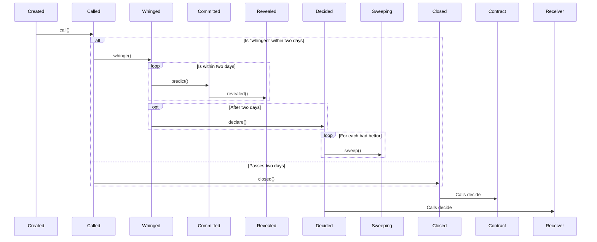

# ARB Infra Markets

ARB Infra Markets are a simple permissionless commit/reveal natural language oracle,
powered by USDC and Staked ARB, built with Arbitrum Stylus. It is primarily used by
[9lives](https://9lives.so), deployed on [Superposition](https://superposition.so) and
Arbitrum One.

[Source code](https://github.com/fluidity-money/9lives.so/blob/main/src/contract_infra_market.rs)



## Terminology

| Identifier |                           Description                             |
|------------|-------------------------------------------------------------------|
| `outcome`  | Votable statement that users can make about a campaign.           |
| Lockup     | A contract with staking features to stake ARB to participate in the Predicting stage. |
| Campaign   | A market needing voting to determine an oracle outcome.           |
| Commitment | The providing of a hash of the form `committer . outcome . seed`. |
| Calling    | Making a first claim as to what the outcome should be for a market. Done with the `call` function. |
| Whinging   | Using the whinge function to disagree with the claim function. |
| Predicting | Using the predict function with a signature to make a Commitment with the amount given staked using Lockup. |
| Sweeping   | The `sweep` function collects funds from users who predicted incorrectly during the predicting stage. |
| Declaring  | Calling the `declare` function on a campaign that's had enough predicting from users. |
| Closing    | Declaring a campaign as complete if it's been in a state of Calling for enough time. |

## Interface

```solidity
/**
 * @notice Register this campaign, taking a small stipend for management from the
 *         creator in the form of $3 fUSDC. Factory caller only.
 * @param trading address to configure this
 * @param incentiveSender to send the initial amount, assuming they approved this.
 * @param desc of the contract to commit as info for users. Should be info for a oracle.
 * @param launchTs to use as the timestamp to begin this infra market.
 *        Could be the conclusion date.
 * @param callDeadlineTs, the last date that this should decide an outcome before
 *        entering into an emergency state.
 */
function register(
    address trading,
    address incentiveSender,
    bytes32 desc,
    uint64 launchTs,
    uint64 callDeadlineTs
) external returns (uint256);

/**
 * @notice Call the outcome, changing the state to allow a user to disagree
 *         with it with the whinge function. Takes a $2 fUSDC bond.
 * @param tradingAddr to call for.
 * @param winner to indicate is the preferred outcome by this user.
 * @param incentiveRecipient to send future incentive amounts, and the refund
 *        for the bond to.
 */
function call(
    address tradingAddr,
    bytes8 winner,
    address incentiveRecipient
) external returns (uint256);

/**
 * @notice Whinge the outcome, indicating that the sender disagrees with the call
 *         decision that was made. This is only possible during a two day window.
 *         A $7 fUSDC must be taken from the user.
 * @param tradingAddr to use for the disagreement that's taking place.
 * @param preferredOutcome to use as the outcome that the whinger disagrees is
 *        the best.
 * @param bondRecipient to send the bond that's refunded back to.
 */
function whinge(
    address tradingAddr,
    bytes8 preferredOutcome,
    address bondRecipient
) external returns (uint256);

/**
 * @notice Make a commitment as to what the preferred outcome should be, now
 *         that there's been calling and whinging. The voting power comes from
 *         the lockup contract, which takes ARB and locks it up for an amount
 *         of time that this trading should close.
 * @param tradingAddr to use as the trading address to make commitments for.
 * @param commit to use as the commitment for what the outcome should be.
 */
function predict(address tradingAddr, bytes32 commit) external;

/**
 * @notice Reveal a previously made commitment. Should be done in the revealing
 *         period (two days after the first whinge, for two days).
 * @param tradingAddr to use as the place for the commitments to be tracked.
 * @param committerAddr to use as the address of the user making commitments.
 * @param outcome to state the previously made commitment was for.
 * @param seed to use as the random nonce for the reveal.
 */
function reveal(
    address tradingAddr,
    address committerAddr,
    bytes8 outcome,
    uint256 seed
) external;

/**
 * @notice Sweep money from a bettor who bet incorrectly, or someone who neglected to
 *         reveal their commitment, who is assumed to be betting that the system
 *         is in an indeterminate state.
 * @param tradingAddr to use as the trading address for the campaign.
 * @param epochNo to use as the epoch number to take funds from.
 * @param victim to claim funds from.
 * @param feeRecipientAddr to send the small amount taken from the victim to (1%).
 */
function sweep(
    address tradingAddr,
    uint256 epochNo,
    address victim,
    address feeRecipientAddr
) external returns (uint256 yieldForFeeRecipient);

/**
 * @notice Capture amounts from the prize pool. Can only be done once, so be careful!
 * @param tradingAddr to capture amounts from.
 * @param epochNo to collect amounts from the pot from.
 * @param feeRecipient to send incentive amounts to.
 */
function capture(
    address tradingAddr,
    uint256 epochNo,
    address feeRecipient
) external returns (uint256 yieldForFeeRecipient);

/**
 * @notice Close this campaign if it's been in a state where anyone can whinge for
 *         some time, two days since someone whinged and no-one had whinged.
 * @param tradingAddr this market is for.
 * @param feeRecipient to send the incentive for closing to.
 */
function close(address tradingAddr, address feeRecipient) external;

/**
 * @notice Escape a trading market that has gone over the limit. This calls
 *         the escape function in the trading contract to indicate something
 *         has gone wrong. This should only be callable if the contract is in the
 *         state for calling past the deadline.
 * @param tradingAddr to escape.
 */
function escape(address tradingAddr) external;

/**
 * @notice Winner that was declared for this infra market, if there is one.
 */
function winner(address tradingAddr) external view returns (bytes8 winnerId);

/**
 * @notice Status of this trading contract's oracle.
 */
function status(address tradingAddr) external view returns (
    InfraMarketState currentState,
    uint64 secsRemaining
);
```

## Creating a campaign (creating a oracle)

Creating a campaign is calling `register(address tradingAddr, address incentiveSender,
bytes32 desc, uint64 launchTs, uint64 deadlineTs)`. In doing so, you must provide a
creation incentive amount of $3 USDC + (the amount of outcomes * $1 fUSDC).

`tradingAddr` is a contract that implements `IDecidable`:

```solidity
interface IDecidable {
    /**
     * @notice Decide an outcome. Only callable by the oracle!
     * @param outcome to set as the winner.
     */
    function decide(bytes8 outcome) external;
}
```

This is the contract that receives a callback with the predicting outcome.

With `outcome` being the "outcome" that should be determined to be the winner. This could
be `bytes8(0)` to indicate an indeterminate state that needs a rerun, a random identifier
indicating "yes" (ie, `0x199c5aae6c811d3a`), and another random identifier to be "no"
(`0xe527943782f1208d`).

Outcome identifiers can be feasibly created at random, you might create one yourself this
way:

	bytes8(keccak256(abi.encodePacked("Yes", block.timestamp)))


### Example contract

The following contract creates a Infra Market to determine if Trump won the election:

```solidity
// SPDX-License-Identifier: MIT
pragma solidity ^0.8.6;

interface IERC20 {
    function transferFrom(address, address, uint256) external;
    function approve(address, uint256) external;
    function transfer(address, uint256) external;
}

interface IDecidable {
    /**
     * @notice Decide an outcome. Only callable by the oracle!
     * @param outcome to set as the winner.
     */
    function decide(bytes8 outcome) external;
}

interface IInfraMarket {
    function register(
        address tradingAddr,
        address incentiveSender,
        bytes32 desc,
        uint64 launchTs,
        uint64 deadlineTs
    ) external returns (uint256);
}

contract PariMutuelMarket is IDecidable {
    bool internal created;

    IERC20 immutable ASSET_PREDICTING;
    IERC20 immutable ASSET_FUSDC;

    IInfraMarket immutable INFRA_MARKET;

    mapping(address => uint256) public predictionsTrumpLost;
    mapping(address => uint256) public predictionsTrumpWon;

    uint256 public allocatedTrumpLost;
    uint256 public allocatedTrumpWon;

    bytes8 public outcomeTrumpLost;
    bytes8 public outcomeTrumpWon;

    bytes8 public winner;

    constructor(
        IERC20 _assetPredicting,
        IERC20 _assetFusdc,
        IInfraMarket _infraMarket
    ) {
        ASSET_PREDICTING = _assetPredicting;
        ASSET_FUSDC = _assetFusdc;
        INFRA_MARKET = _infraMarket;
    }

    function setUp() external {
        // Send the infra market the incentive amount after doing approval. This
        // amount is to seed liquidity, as well as pay fees owed to the contract.
        // A contract like this could instead supply the caller as the argument
        // as incentiveSender, but we do it here for simplicity reasons.
        require(!created, "already set up");
        created = true;
        uint256 seedAmount = 3e6 + 2e6;
        ASSET_FUSDC.transferFrom(msg.sender, address(this), seedAmount);
        ASSET_FUSDC.approve(address(INFRA_MARKET), seedAmount);
        outcomeTrumpLost = bytes8(keccak256(abi.encodePacked("No", block.timestamp)));
        outcomeTrumpWon = bytes8(keccak256(abi.encodePacked("Yes", block.timestamp)));
        // Now that we know the outcomes, we need to register with the infra
        // market. This description could be the hash for something in IPFS, and
        // be something of the form that's quite complex in its description
        // (maybe a JSON blob or an image), but in this example, it's set here.
        // We set the desc to also include a random number to prevent collisions.
        bytes32 desc = keccak256(abi.encodePacked("This oracle should resolve to Yes if Donald Trump is called as the winner of the US election by CNN, The Associated Press, and Fox News. It should resolve to No under any other circumstances.", block.timestamp));
        INFRA_MARKET.register(
            address(this),
            address(this),
            desc,
            uint64(block.timestamp + 1),
            type(uint64).max // We set the end date of the market to the maximum number.
        );
    }

    function predictTrumpLost(uint256 _amount, address _recipient) external {
        require(winner == bytes8(0), "winner set already");
        ASSET_PREDICTING.transferFrom(msg.sender, address(this), _amount);
        allocatedTrumpLost += _amount;
        predictionsTrumpLost[_recipient] += _amount;
    }

    function predictTrumpWon(uint256 _amount, address _recipient) external {
        require(winner == bytes8(0), "winner set already");
        // Take from the user the amount that they asked to predict with.
        ASSET_PREDICTING.transferFrom(msg.sender, address(this), _amount);
        allocatedTrumpWon += _amount;
        predictionsTrumpWon[_recipient] += _amount;
    }

    /**
     * @notice Decide is called by the Infra Market to set the winner.
     */
    function decide(bytes8 _outcome) external {
        require(msg.sender == address(INFRA_MARKET), "not infra market");
        winner = _outcome;
    }

    /**
     * @notice Claim from incorrect bettors who predicted that Trump would win.
     */
    function claimTrumpLost(address _recipient) external returns (uint256) {
        require(winner == outcomeTrumpLost);
        require(predictionsTrumpLost[msg.sender] > 0, "empty or already claimed");
        uint256 amt = predictionsTrumpLost[msg.sender];
        uint256 shareOfWinners = (100 * amt) / allocatedTrumpLost;
        uint256 shareOfLosers = (shareOfWinners * allocatedTrumpWon) / 100;
        ASSET_PREDICTING.transfer(_recipient, shareOfLosers);
        predictionsTrumpLost[msg.sender] = 0;
        return shareOfLosers;
    }

    /**
     * @notice Claim from incorrect bettors who predicted that Trump would lose.
     */
    function claimTrumpWon(address _recipient) external returns (uint256) {
        require(winner == outcomeTrumpWon);
        require(predictionsTrumpWon[msg.sender] > 0, "empty or already claimed");
        uint256 amt = predictionsTrumpWon[msg.sender];
        uint256 shareOfWinners = (100 * amt) / allocatedTrumpWon;
        uint256 shareOfLosers = (shareOfWinners * allocatedTrumpLost) / 100;
        ASSET_PREDICTING.transfer(_recipient, shareOfLosers);
        predictionsTrumpWon[msg.sender] = 0;
        return shareOfLosers;
    }
}
```

## "Calling" an outcome
